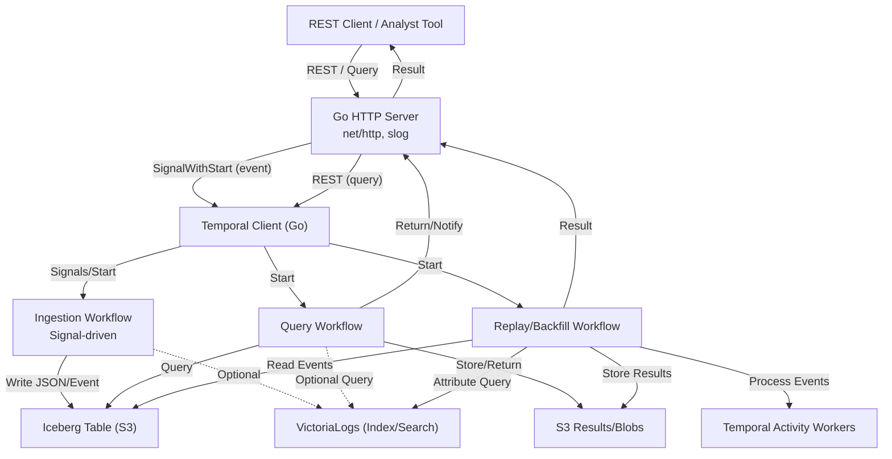
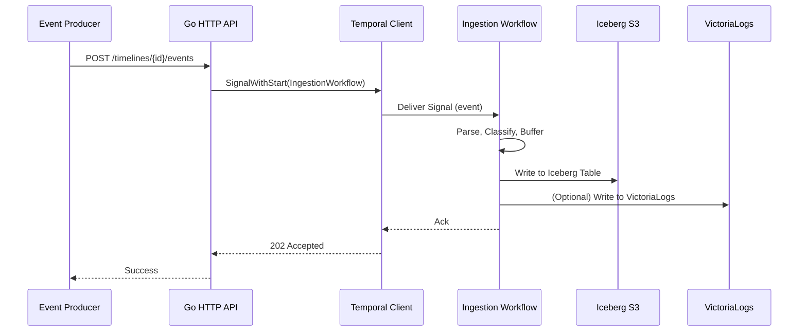
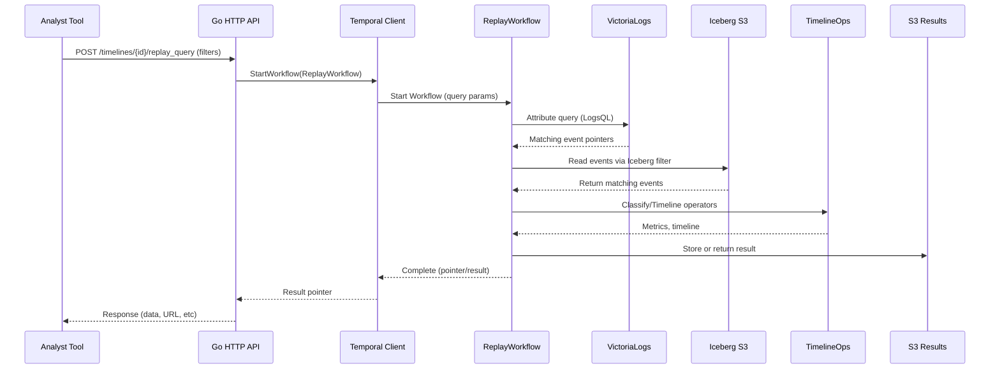
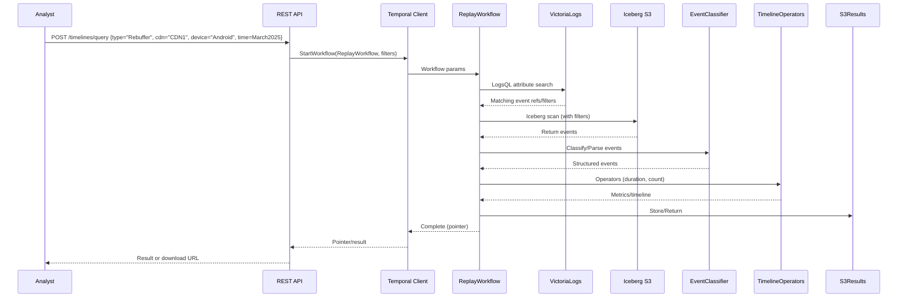
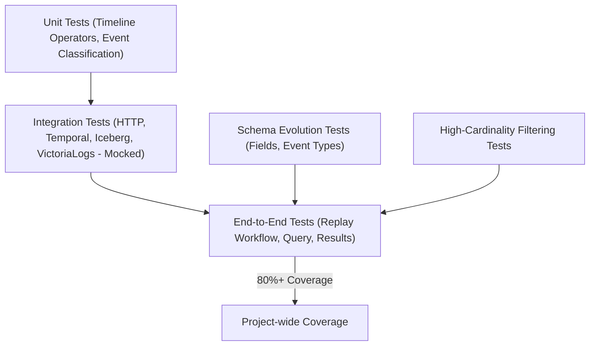

# AGENT.md

## Timeline Analytics Platform: Implementation Brief for Handoff

### Purpose

This file contains a comprehensive standalone summary and architecture for the Timeline Analytics Platform based on all requirements, PRDs, and augmentations to date. It is written so a new engineer or agent can pick up implementation, test, or design work without any external references.

---

## Table of Contents

1. Overview and High-Level Goals
2. Key Architecture Components
3. Data Ingestion, Event Modeling, and Storage
4. Temporal Orchestration Patterns
5. Timeline Operators and Data Processing
6. Attribute Filtering and Historical Replay
7. Testing & Coverage Strategy
8. MermaidJS Architecture Diagrams (Valid, Copy-Paste Ready)

---

### 1. Overview and High-Level Goals

The Timeline Analytics Platform is a Go-based (v1.24.3+) distributed service for time-state analytics on event logs and time-series data. Its mission is to support both real-time and replay/batch analytics on large-scale event streams, using Timeline Algebra (state machines, interval analysis) and orchestrated with Temporal workflows. Key storage is in S3 (Iceberg format); attribute search is powered by VictoriaLogs. Everything must be idiomatic Go, idiomatic Temporal, with structured logging via slog and coverage of at least 80% by automated tests.

**Functional requirements include:**

* Ingest, store, and process time-series event logs (high-cardinality, arbitrary schema)
* Expose a REST API (Go net/http, slog)
* Orchestrate all logic with Temporal (durable, reliable, scalable)
* Efficiently replay and backfill for analytic queries using S3/Iceberg, with fast attribute filtering via VictoriaLogs
* Extract and classify event types from arbitrary logs for Timeline Algebra
* Full support for schema evolution, high-cardinality filtering, and robust integration tests

---

### 2. Key Architecture Components

#### REST API (Go net/http)

* Handles event ingestion (`POST /timelines/{id}/events`) and queries (`POST /timelines/{id}/query`, `/replay_query`)
* Logs all requests/responses via slog (JSON for prod, text for dev)
* Talks to Temporal via the Go SDK (signal-driven for real-time, direct start for queries/backfills)

#### Temporal Workflows

* **IngestionWorkflow:** Receives events via signal, parses/classifies, persists to S3 Iceberg (and optionally VictoriaLogs)
* **QueryWorkflow:** Used for real-time timeline analytics; orchestrates Timeline operator logic on recent data
* **ReplayWorkflow:** Orchestrates batch replay/backfill analytics. Can chunk by time, fan out via child workflows, or loop with ContinueAsNew
* **Activity Workers:** Run external I/O (Iceberg reads, VictoriaLogs queries, S3 writes/reads, heavy CPU ops)

#### Storage and Indexing

* **Iceberg on S3:** All events are durably persisted in Iceberg tables partitioned by time (and optionally other fields). Supports schema evolution and efficient predicate/column pushdown
* **VictoriaLogs:** Indexes all fields of ingested logs (arbitrary schema, high cardinality) for fast search and attribute filtering
* **S3 Results:** Result data (query outputs, blobs) stored in S3; pointer returned for large results

---

### 3. Data Ingestion, Event Modeling, and Storage

* Events are structured logs (JSON, potentially arbitrary schema and high-cardinality attributes)
* Event ingestion is signal-driven: REST API delivers event(s) to Temporal IngestionWorkflow using SignalWithStart (by timeline/session ID)
* Events are **immediately persisted to S3 Iceberg tables** (minimizing loss risk and enabling replay/backfill). Optionally also ingested into VictoriaLogs for fast attribute search
* Event classification: Each log must be mapped to a canonical event type (e.g., Play, Seek, Rebuffer, etc.) and extract key fields/attributes. This is done by an EventClassifier component (Go function or interface)
* **Flexible event model:**

  * Strongly-typed event structs for known types, with a map\[string]interface{} for attributes
  * Generic event struct for unknown/new types
  * Schema evolution is handled via attribute maps and periodic updates to type registry
* All events must have timestamp, type, and raw attributes
* Iceberg schema is flexible: some universal columns, plus an attributes map

---

### 4. Temporal Orchestration Patterns

* **Ingestion:**

  * SignalWithStart ensures at-most-one IngestionWorkflow per timeline (ID scheme: `timeline-{id}`)
  * Receives signals for each event batch, writes to Iceberg, optionally mirrors to VictoriaLogs
  * ContinueAsNew to avoid unbounded history

* **Query/Replay:**

  * QueryWorkflow: ad-hoc or scheduled analytic queries over recent (real-time) or historical (replay/backfill) data
  * ReplayWorkflow: triggered by REST API, starts with query params (time, filters, etc.)
  * VictoriaLogs activity: runs attribute filter to narrow down event set for Iceberg scan
  * Iceberg activity: fetches relevant events (predicate pushdown, column projection)
  * Processing: runs Timeline operator chain on parsed/classified events, returns metrics or timeline as result
  * For large data, workflow splits by time, partitions, or child workflows, checkpoints via ContinueAsNew

* **Concurrency:** Multiple workflows run in parallel (each timeline, query, or replay is a separate workflow instance); scaling is via Temporal workers and S3 concurrency

---

### 5. Timeline Operators and Data Processing

* **Event stream → Timeline transformation:**

  * Operators: LatestEventToState, HasExisted, HasExistedWithin, AND/OR/NOT combination, DurationWhere, aggregation, windowing
  * Operators are Go functions acting on slices of typed events or intervals
  * Processing can occur in workflow (if data small) or as activities (for larger sets or CPU-intensive ops)
  * Operators chain as a DAG as specified in query JSON
  * Operators must be tested for all edge cases (missing fields, boundary conditions, overlapping intervals)

---

### 6. Attribute Filtering and Historical Replay

* For ad-hoc or batch queries (e.g., backfill, fraud analysis), the system uses the following steps:

  1. Analyst submits a query with filters (event type, attributes, time window) to REST API
  2. API starts ReplayWorkflow in Temporal with params
  3. ReplayWorkflow first runs a VictoriaLogs query to get pointers or filter for matching events
  4. Iceberg activity reads only the relevant partitions/columns/fields (using results from VictoriaLogs as filter)
  5. Events are parsed and classified, then processed by Timeline operators
  6. Result is either returned in response, or written as a file/blob to S3 and the pointer is returned
* Both real-time and backfill can operate concurrently; ingestion is always immediately persisted, so no loss

---

### 7. Testing & Coverage Strategy

* **Unit tests:** Pure logic (Timeline operators, event classification, parsing, interval math). Table-driven for field variations, missing data, type errors
* **Integration tests:** Simulate REST API, Temporal workflows/activities with mocked external dependencies (Iceberg, VictoriaLogs, S3). Assert end-to-end logic, edge cases
* **E2E tests:** In Temporal’s test environment, full run of a workflow (e.g., replay with VictoriaLogs + Iceberg + timeline operators + result return)
* **Schema evolution tests:** Simulate old and new event formats, adding/removing fields, new event types; verify backward/forward compatibility
* **High-cardinality tests:** Test attribute filter with unique IDs, confirm VictoriaLogs avoids full scans, fallback path correctness
* **Load/stress:** Simulate large backfills (many events, partitions), test scaling by chunking and child workflows
* **Coverage goal:** 80%+ project-wide; coverage tracked in CI/CD

---

### 8. MermaidJS Architecture Diagrams (Valid, Copy-Paste Ready)

#### Overall System Architecture



#### Real-Time Ingestion (Test Scenario)



#### Replay/Backfill Query (Test Scenario)



#### Attribute Filtering/Timeline Query Example (Test Case)



#### Testing Coverage Map



---

## Implementation Status & Recent Changes

### ✅ **COMPLETED: Fintech Timeline Operators & Type System (June 2025)**

**Major accomplishment:** Successfully resolved all type system conflicts and implemented comprehensive financial operators suitable for real-world fintech applications.

#### **Type System Architecture (CRITICAL for future development):**
- **`NumericTimeline`** (`[]NumericInterval`): For state-based operations with start/end intervals
- **`PriceTimeline`** (`[]NumericValue`): For point-in-time financial data with timestamps 
- **Backward compatibility:** `ConvertEventTimelineToNumeric()` and `ConvertEventTimelineToPriceTimeline()` functions
- **Clean separation:** Financial operators use `PriceTimeline`, state operators use `NumericTimeline`

#### **Financial Operators Implemented:**
- **Technical Indicators:** TWAP, VWAP, Bollinger Bands, RSI, MACD
- **Risk Metrics:** VaR (Value at Risk), Drawdown, Sharpe Ratio  
- **AML/Compliance:** Transaction Velocity, Position Exposure
- **Windowing:** Sliding, Tumbling, Session windows with financial data support
- **Aggregations:** Moving averages, percentiles, statistical functions

#### **Test Coverage Achieved:**
- **Timeline Package:** 87.2% coverage (exceeds 80% target)
- **Temporal Package:** 41.8% coverage  
- **All financial operators:** Comprehensive test coverage with real-world scenarios
- **All tests passing:** Fixed TestMovingAggregate, TestPositionExposure, TestCreateSlidingWindows

#### **Build Status:**
- ✅ `go build` - successful compilation
- ✅ `go test ./pkg/timeline/ ./pkg/temporal/` - all tests pass
- ⚠️ `go test ./pkg/http/` - has mock setup issues (not blocking, outside fintech scope)

### **Commands for Testing & Development:**
```bash
# Test core timeline functionality
go test ./pkg/timeline/ -v

# Test temporal integration  
go test ./pkg/temporal/ -v

# Check coverage
go test ./pkg/timeline/ ./pkg/temporal/ -coverprofile=coverage.out
go tool cover -html=coverage.out -o coverage.html

# Build application
go build
```

### **Key Files Modified:**
- `pkg/timeline/types.go` - Consolidated type definitions
- `pkg/timeline/fintech.go` - All financial operators
- `pkg/timeline/aggregations.go` - Added PriceTimeline support  
- `pkg/timeline/windows.go` - Financial windowing support
- `pkg/temporal/activities.go` - Updated for PriceTimeline integration
- All test files updated for new type system

### **Next Steps for Successor:**
1. **HTTP Layer:** Fix mock setup in `pkg/http/server_test.go` for complete test coverage
2. **Performance:** Optimize financial calculations for large datasets
3. **Storage Integration:** Implement actual Iceberg/VictoriaLogs integration (currently mocked)
4. **Additional Indicators:** Add more technical indicators (Stochastic, Williams %R, etc.)
5. **Real-time Streaming:** Enhance streaming capabilities for live market data

### **Critical Notes for Future Development:**
- **NEVER mix NumericTimeline and PriceTimeline** - use conversion functions
- Financial operators require point-in-time data (PriceTimeline), not intervals
- All new financial operators should follow patterns in `pkg/timeline/fintech.go`
- Always test with realistic financial data scenarios (gaps, weekends, etc.)
- Maintain backward compatibility through conversion functions

---

## Notes for Successor

* Always favor idiomatic Go and Temporal patterns
* All new event types must be registered in the EventClassifier registry; fallback to map-based generic event
* All queries and replays are orchestrated through Temporal workflows for durability and auditing
* Use VictoriaLogs to minimize scan/read cost for attribute filtering and high-cardinality queries
* Prefer column/predicate pushdown in Iceberg reads to minimize data movement
* Implement all new Timeline operators with full unit and scenario-based test coverage
* **IMPORTANT:** Respect the NumericTimeline vs PriceTimeline type separation detailed above
* Document all changes and update this file so future agents can continue seamlessly

