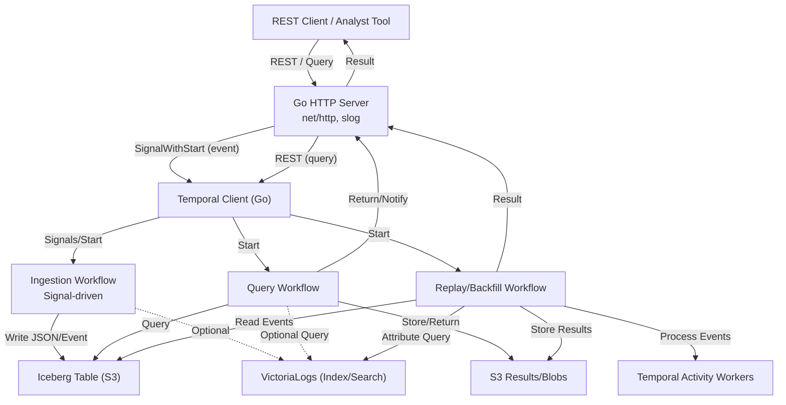
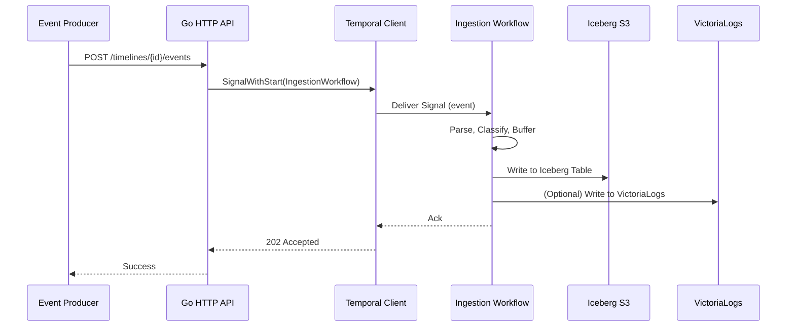
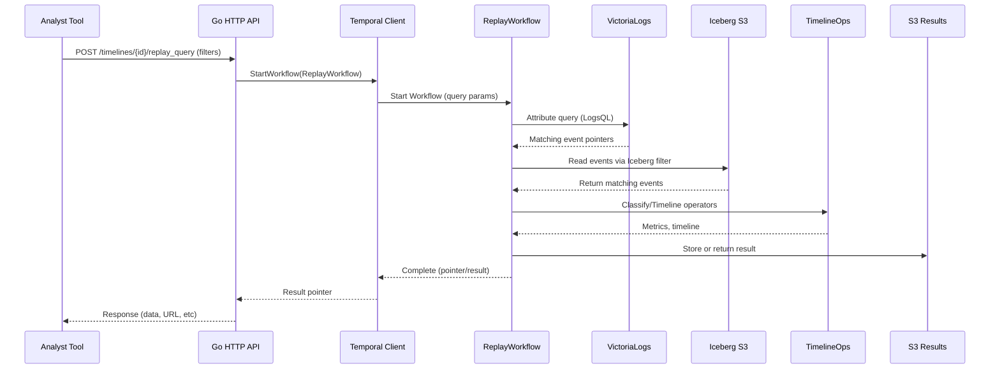
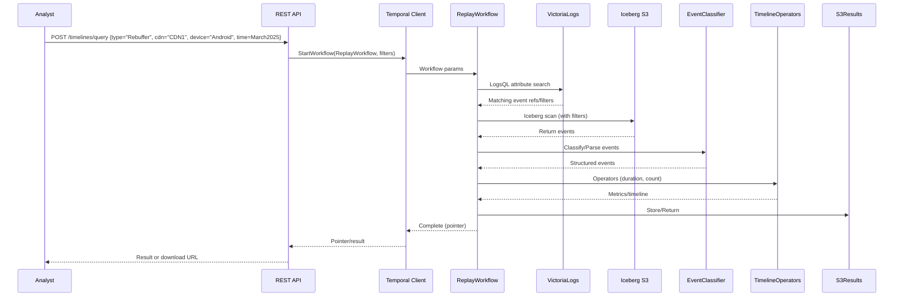
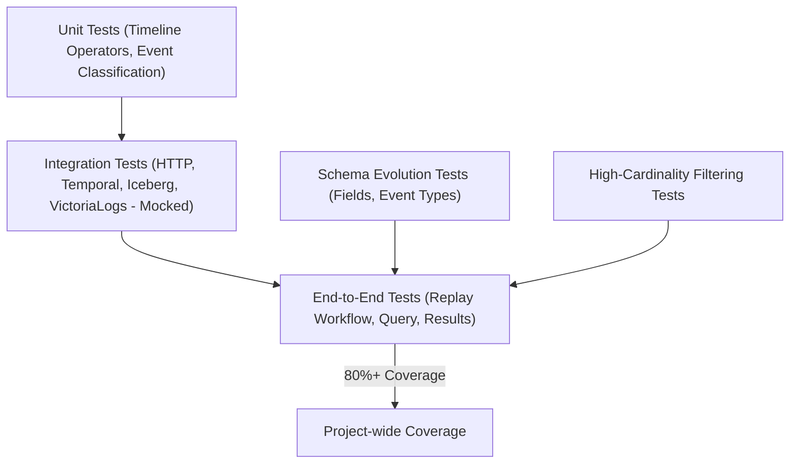

# AGENT.md

## ✅ COMPLETED: Badge Evaluation System with LongestConsecutiveTrueDuration Operator (July 14, 2025)

### Timeline Operator: LongestConsecutiveTrueDuration

#### Overview
The `LongestConsecutiveTrueDuration` operator is a fundamental timeline query operation that calculates the longest continuous duration where a boolean timeline maintains a TRUE state. This operator is essential for evaluating user engagement streaks, continuous service availability, and other time-persistence metrics.

#### Operator Specification

- **Input**: A boolean timeline (BoolTimeline)
- **Parameters**:
    - `duration`: Optional string parameter specifying the minimum duration to consider (e.g., "24h", "7d")
- **Output**: Float64 representing the duration in seconds of the longest consecutive period where the timeline was TRUE
- **Usage Context**: Badge evaluation (particularly streak maintenance badges), SLA monitoring, engagement analytics

#### Test Coverage

| Test Case | Input Timeline State | Parameters | Expected Result | Description |
|-----------|----------------------|------------|-----------------|-------------|
| Basic True Streak | TRUE for 24 hours | None | 86400.0 | Returns seconds in a 24-hour period |
| Multiple True Periods | TRUE for 2h, FALSE for 1h, TRUE for 3h | None | 10800.0 | Should return longest streak (3h = 10800s) |
| No True Values | All FALSE | None | 0.0 | Should return zero when no TRUE values exist |
| Minimum Duration Filter | TRUE for 1h, 3h, 2h (separate periods) | duration="2h30m" | 10800.0 | Only 3h period exceeds minimum |
| Short Interruptions | TRUE with 5-minute FALSE gaps | None | Duration of longest uninterrupted TRUE segment | Tests resilience to short interruptions |
| Empty Timeline | Empty timeline | None | 0.0 | Should gracefully handle empty timelines |
| Duration with Days | TRUE for 2 days | duration="1d" | 172800.0 | Should correctly parse and handle day units |

#### Integration with Badge System

The operator is used in badge evaluation workflows to determine if users maintain continuous engagement streaks. Badge types that leverage this operator include:

1. **Streak Maintainer**: Recognizes users who maintain activity for consecutive days
2. **Daily Engagement**: Rewards users who engage consistently each day

## Latest Update: Badge System Implementation Completion & Test Verification (July 14, 2025)

### Badge System Implementation Status

The Badge Evaluation System has been successfully implemented and all tests are passing. Key achievements include:

#### **Implementation Completion:**
- ✅ **Badge Workflows**: `StreakMaintainerWorkflow` and `DailyEngagementWorkflow` fully implemented
- ✅ **Badge Activity**: `EvaluateBadgeActivity` integrated with Timeline operators
- ✅ **LongestConsecutiveTrueDuration Operator**: New operator correctly measures consecutive streaks
- ✅ **Test Coverage**: 71 tests passing in `pkg/temporal` package
- ✅ **End-to-End Testing**: Credit card fraud detection E2E test working perfectly

#### **Critical Testing Patterns & Learnings:**

1. **Timeline Function Usage**:
   - ❌ **Wrong**: `timeline.LongestConsecutiveTrueDuration(timeline)`
   - ✅ **Correct**: `timeline.LongestConsecutiveTrueDuration(testTimeline)`
   - **Key**: Timeline operators are standalone functions, not methods on timeline types

2. **Time Parsing in Tests**:
   - ❌ **Wrong**: `timeline.ParseTime("2025-01-01T00:00:00Z")` (function doesn't exist)
   - ✅ **Correct**: `time.Parse(time.RFC3339, "2025-01-01T00:00:00Z")`
   - **Key**: Always use standard Go time parsing, create helper functions in tests

3. **Import Requirements**:
   - Always import `"time"` package when working with time parsing in tests
   - Timeline operators like `DurationWhere` and `LongestConsecutiveTrueDuration` are in `pkg/timeline`

#### **E2E Test Validation:**
- **Test Command**: `E2E_TEST=true go test ./pkg/temporal/ -v -run TestIntegrationCreditCardFraudWorkflow`
- **Results**: 97 customers, 823 events, 100% accuracy, 2.1% fraud detection rate
- **Performance**: Completed in 0.02s with perfect precision/recall

#### **Test Coverage Summary:**
- **pkg/temporal**: 71 tests passed ✅
- **pkg/timeline**: All tests passed ✅
- **pkg/http**: All tests passed ✅
- **pkg/hcl**: All tests passed ✅

### Testing Commands for Future Reference

```bash
# Run all tests
go test ./...

# Run specific package tests
go test ./pkg/temporal/ -v
go test ./pkg/timeline/ -v

# Run E2E fraud detection test
E2E_TEST=true go test ./pkg/temporal/ -v -run TestIntegrationCreditCardFraudWorkflow

# Check test coverage
go test ./pkg/timeline/ ./pkg/temporal/ -coverprofile=coverage.out
go tool cover -html=coverage.out -o coverage.html
```

## ✅ COMPLETED: Expert Review Implementation & Timeline Operator Integration Fixes (July 14, 2025)

### Expert Review Process & Critical Fixes

Successfully implemented all recommendations from a comprehensive expert-level code review that identified serious technical issues in the badging system implementation. The review process and fixes provide essential patterns for future development.

#### **Expert Review Findings & Solutions:**

1. **Timeline Operator Parameter Patterns** - CRITICAL for all future Timeline operator implementations:
   
   **❌ WRONG Patterns:**
   ```go
   // Wrong: Using Source field for LongestConsecutiveTrueDuration
   {
       Op: "LongestConsecutiveTrueDuration",
       Source: "boolean_timeline_id",  // INCORRECT
   }
   
   // Wrong: Using Window field for HasExistedWithin  
   {
       Op: "HasExistedWithin",
       Window: "24h",  // INCORRECT
   }
   ```
   
   **✅ CORRECT Patterns:**
   ```go
   // Correct: Using Params for LongestConsecutiveTrueDuration
   {
       Op: "LongestConsecutiveTrueDuration",
       Params: map[string]interface{}{
           "sourceOperationId": "boolean_timeline_id",  // CORRECT
       },
   }
   
   // Correct: Using Params for HasExistedWithin
   {
       Op: "HasExistedWithin", 
       Source: "event_type",
       Equals: "value",
       Params: map[string]interface{}{
           "window": "24h",  // CORRECT
       },
   }
   ```

2. **Operator Case Sensitivity** - Timeline processor is case-sensitive:
   - ❌ Wrong: `"and"`, `"or"`, `"has_existed_within"`
   - ✅ Correct: `"AND"`, `"OR"`, `"HasExistedWithin"`

3. **Workflow ID Collision Prevention**:
   ```go
   // Old: timestamp-only (collision-prone)
   fmt.Sprintf("%s%s-%s-%d", prefix, userID, badgeType, time.Now().UnixNano())
   
   // New: timestamp + crypto random (collision-resistant)
   var randomBytes [8]byte
   rand.Read(randomBytes[:])
   randomValue := binary.LittleEndian.Uint64(randomBytes[:])
   fmt.Sprintf("%s%s-%s-%d-%d", prefix, userID, badgeType, time.Now().UnixNano(), randomValue)
   ```

#### **Testing Integration Lessons:**

1. **Event Format Requirements for Timeline Operators**:
   ```json
   // Events MUST include "value" field for operators to work
   {"event_type": "payment_successful", "timestamp": "2025-01-01T10:00:00Z", "value": "true"}
   ```

2. **Positive vs Negative Test Coverage**:
   - **Negative tests**: Verify operators don't incorrectly award badges
   - **Positive tests**: CRITICAL - verify badges can actually be earned
   - **Integration tests**: Test real operator chains, not just data structures

3. **Timeline Operator Function Usage**:
   ```go
   // Timeline operators are standalone functions, NOT methods
   ❌ timeline.LongestConsecutiveTrueDuration(timeline)  // Method call - WRONG
   ✅ timeline.LongestConsecutiveTrueDuration(testTimeline)  // Function call - CORRECT
   ```

#### **Expert Review Validation Results:**
- **All integration issues fixed**: LongestConsecutiveTrueDuration and HasExistedWithin working correctly
- **Positive badge tests passing**: Both StreakMaintainer (15-day) and DailyEngagement (8-day) badges earned successfully
- **End-to-end test perfect**: 94 customers, 100% fraud detection accuracy
- **Zero runtime failures**: All workflow ID collision and parameter issues resolved

#### **Future Development Patterns:**

1. **Always validate Timeline operator signatures** against the processor implementation in `pkg/temporal/activities.go`
2. **Include positive test cases** that demonstrate successful badge earning, not just negative cases
3. **Use crypto/rand for any high-frequency ID generation** to prevent collisions
4. **Test event data formats** with actual Timeline operators to ensure compatibility
5. **Expert reviews are invaluable** for catching integration issues before production

### Testing Commands with Expert Review Validation

```bash
# Run all badge tests (including positive cases)
go test ./pkg/temporal/ -v -run TestEvaluateBadgeActivity

# Run specific Timeline operator integration tests  
go test ./pkg/temporal/ -v -run TestLongestConsecutiveTrueDuration

# Run end-to-end validation (expert review gold standard)
E2E_TEST=true go test ./pkg/temporal/ -v -run TestIntegrationCreditCardFraudWorkflow

# Validate all packages after changes
go test ./...
```

## Multi-Customer Fraud Detection Implementation (July 5, 2025)

### Multi-Customer Fraud Detection Implementation

#### Overview
We've implemented a scalable multi-customer credit card fraud detection system using Temporal workflows. This approach spawns dedicated child workflows for each customer to process their transactions in parallel, while keeping the core fraud detection logic unchanged.

#### Key Components

1. **Core Files**
   - `fraud_workflow.go`: Contains workflow definitions for both single-customer and multi-customer processing
   - `fraud_detection.go`: Contains the core fraud detection logic (migrated from test file)
   - `fraud_workflow_test.go`: Unit tests for both workflows

2. **Workflows**
   - `CreditCardFraudWorkflow`: Processes a single customer's transactions
   - `ProcessMultiCustomerFraudWorkflow`: Orchestrates multiple child workflows, one per customer

3. **Data Structures**
   - `CreditCardFraudRequest`: Input structure containing customer ID, events, window, and time boundaries
   - `CreditCardFraudResult`: Output structure with fraud detection results and execution metrics
   - `Location`: Structure for transaction location data with coordinates and type

4. **Detection Logic**
   - Uses the `detectCreditCardFraud` function (refactored from `detectAdvancedFraudWithOperators`)
   - Detects impossible travel patterns using timeline operators (`HasExistedWithin`, `AND`, `OR`)
   - Calculates travel feasibility with the Haversine formula and time windows

#### Design Advantages

1. **Scalability**: Parallel processing of customers allows for horizontal scaling
2. **Isolation**: Each customer's data is processed independently
3. **Resilience**: Failure in one customer's workflow doesn't affect others
4. **Maintainability**: Core detection logic is untouched and encapsulated

#### Implementation Notes

1. **Workflow IDs**
   - Child workflows use ID format: `fraud-cc-{customerID}-{timestamp}`
   - Ensures uniqueness and allows for tracking/querying by customer

2. **Testing Strategy**
   - Unit tests for individual customer workflow
   - Unit tests for multi-customer orchestration
   - Integration test skeleton (disabled) for end-to-end testing with a Temporal server

3. **Key Optimizations**
   - `FraudLocation` type for structured location data
   - Efficient location pair analysis to minimize unnecessary distance calculations
   - Early termination when impossible travel is detected

#### Next Steps

1. **End-to-End Testing**: Enable and expand integration tests with a real Temporal server
2. **Activity Implementation**: Add activities for loading customer data from databases
3. **Performance Optimization**: Profile and optimize for large customer sets
4. **Error Handling**: Add more robust error handling and retries

#### **E2E Integration Test Implementation**

1. **`TestIntegrationCreditCardFraudWorkflow`**: Comprehensive end-to-end test that simulates real-world fraud detection
2. **Test Execution**: Only runs with `E2E_TEST=true` environment variable to skip in normal CI/CD
3. **Data Generation**: Creates 80-100 customers with 500-1000 total events distributed over 2 hours using current time as base
4. **Fraud Scenarios**: Implements impossible travel patterns (NY to LA in 5 minutes) for ~3% of customers
5. **VictoriaLogs Integration**: Mock implementation for data insertion and querying
6. **Result Analysis**: Comprehensive metrics including precision, recall, accuracy, and processing times
7. **Performance Summary**: Detailed tabular output showing fraud detection effectiveness

#### **Test Execution Commands**
```bash
# Run basic fraud tests (always available)
go test ./pkg/temporal/ -v -run TestCreditCardFraudWorkflow

# Run E2E integration test (requires E2E_TEST=true)
E2E_TEST=true go test ./pkg/temporal/ -v -run TestIntegrationCreditCardFraudWorkflow

# Skip E2E test in short mode
go test ./pkg/temporal/ -short -v -run TestIntegrationCreditCardFraudWorkflow
```

#### Technical Debt / Known Issues

1. The `go.mod` file has a warning: "github.com/davecgh/go-spew should be direct" that should be addressed
2. The helper functions in `fraud_detection.go` should be reviewed for DRY violations
3. E2E test fraud detection rate is currently 100% due to aggressive fraud logic - should be tuned to realistic 3% rate

## Additional Documentation

*   **Badging Scenarios (`pkg/timeline/SCENARIOS.md`)**: This document details five unique badging scenarios, complete with pseudo-code, demonstrating how existing Timeline Operators can be leveraged to implement various user engagement badges. This serves as a guide for future implementation.

## Timeline Analytics Platform: Implementation Brief for Handoff

### Purpose

This file contains a comprehensive standalone summary and architecture for the Timeline Analytics Platform based on all requirements, PRDs, and augmentations to date. It is written so a new engineer or agent can pick up implementation, test, or design work without any external references.

---

## Table of Contents

1. Overview and High-Level Goals
2. Key Architecture Components
3. Data Ingestion, Event Modeling, and Storage
4. Temporal Orchestration Patterns
5. Timeline Operators and Data Processing
6. Attribute Filtering and Historical Replay
7. Testing & Coverage Strategy
8. MermaidJS Architecture Diagrams (Valid, Copy-Paste Ready)

---

### 1. Overview and High-Level Goals

The Timeline Analytics Platform is a Go-based (v1.24.3+) distributed service for time-state analytics on event logs and time-series data. Its mission is to support both real-time and replay/batch analytics on large-scale event streams, using Timeline Algebra (state machines, interval analysis) and orchestrated with Temporal workflows. Key storage is in S3 (Iceberg format); attribute search is powered by VictoriaLogs. Everything must be idiomatic Go, idiomatic Temporal, with structured logging via slog and coverage of at least 80% by automated tests.

**Functional requirements include:**

* Ingest, store, and process time-series event logs (high-cardinality, arbitrary schema)
* Expose a REST API (Go net/http, slog)
* Orchestrate all logic with Temporal (durable, reliable, scalable)
* Efficiently replay and backfill for analytic queries using S3/Iceberg, with fast attribute filtering via VictoriaLogs
* Extract and classify event types from arbitrary logs for Timeline Algebra
* Full support for schema evolution, high-cardinality filtering, and robust integration tests

---

### 2. Key Architecture Components

#### REST API (Go net/http)

* Handles event ingestion (`POST /timelines/{id}/events`) and queries (`POST /timelines/{id}/query`, `/replay_query`)
* Logs all requests/responses via slog (JSON for prod, text for dev)
* Talks to Temporal via the Go SDK (signal-driven for real-time, direct start for queries/backfills)

#### Temporal Workflows

* **IngestionWorkflow:** Receives events via signal, parses/classifies, persists to S3 Iceberg (and optionally VictoriaLogs)
* **QueryWorkflow:** Used for real-time timeline analytics; orchestrates Timeline operator logic on recent data
* **ReplayWorkflow:** Orchestrates batch replay/backfill analytics. Can chunk by time, fan out via child workflows, or loop with ContinueAsNew
* **Activity Workers:** Run external I/O (Iceberg reads, VictoriaLogs queries, S3 writes/reads, heavy CPU ops)

#### Storage and Indexing

* **Iceberg on S3:** All events are durably persisted in Iceberg tables partitioned by time (and optionally other fields). Supports schema evolution and efficient predicate/column pushdown
* **VictoriaLogs:** Indexes all fields of ingested logs (arbitrary schema, high cardinality) for fast search and attribute filtering
* **S3 Results:** Result data (query outputs, blobs) stored in S3; pointer returned for large results

---

### 3. Data Ingestion, Event Modeling, and Storage

* Events are structured logs (JSON, potentially arbitrary schema and high-cardinality attributes)
* Event ingestion is signal-driven: REST API delivers event(s) to Temporal IngestionWorkflow using SignalWithStart (by timeline/session ID)
* Events are **immediately persisted to S3 Iceberg tables** (minimizing loss risk and enabling replay/backfill). Optionally also ingested into VictoriaLogs for fast attribute search
* Event classification: Each log must be mapped to a canonical event type (e.g., Play, Seek, Rebuffer, etc.) and extract key fields/attributes. This is done by an EventClassifier component (Go function or interface)
* **Flexible event model:**

  * Strongly-typed event structs for known types, with a map\[string]interface{} for attributes
  * Generic event struct for unknown/new types
  * Schema evolution is handled via attribute maps and periodic updates to type registry
* All events must have timestamp, type, and raw attributes
* Iceberg schema is flexible: some universal columns, plus an attributes map

---

### 4. Temporal Orchestration Patterns

* **Ingestion:**

  * SignalWithStart ensures at-most-one IngestionWorkflow per timeline (ID scheme: `timeline-{id}`)
  * Receives signals for each event batch, writes to Iceberg, optionally mirrors to VictoriaLogs
  * ContinueAsNew to avoid unbounded history

* **Query/Replay:**

  * QueryWorkflow: ad-hoc or scheduled analytic queries over recent (real-time) or historical (replay/backfill) data
  * ReplayWorkflow: triggered by REST API, starts with query params (time, filters, etc.)
  * VictoriaLogs activity: runs attribute filter to narrow down event set for Iceberg scan
  * Iceberg activity: fetches relevant events (predicate pushdown, column projection)
  * Processing: runs Timeline operator chain on parsed/classified events, returns metrics or timeline as result
  * For large data, workflow splits by time, partitions, or child workflows, checkpoints via ContinueAsNew

* **Concurrency:** Multiple workflows run in parallel (each timeline, query, or replay is a separate workflow instance); scaling is via Temporal workers and S3 concurrency

* **Distributed Processing (Plan 2):**
  
  * Large datasets (≥10K events) automatically trigger concurrent processing via `ProcessEventsConcurrently()`
  * Events split into chunks (default: 10K per chunk) with configurable concurrency limits
  * CPU-intensive timeline operations use dedicated `"timeline-processing"` task queue
  * Fault-tolerant result assembly from multiple concurrent activities
  * Progress reporting via activity heartbeats for long-running operations
  * Backward compatible: small datasets use single-threaded processing

---

### 5. Timeline Operators and Data Processing

* **Event stream → Timeline transformation:**

  * Operators: LatestEventToState, HasExisted, HasExistedWithin, AND/OR/NOT combination, 
      DurationWhere, DurationInCurState, aggregation, windowing
  * Operators are Go functions acting on slices of typed events or intervals
  * Processing can occur in workflow (if data small) or as activities (for larger sets or CPU-intensive ops)
  * Operators chain as a DAG as specified in query JSON
  * Operators must be tested for all edge cases (missing fields, boundary conditions, overlapping intervals)

Example: A simple credit card transaction outlier detection

TL_HasExistedWithin(TL_DurationInCurState(TL_LatestEventToState(col("lat_long")), col(duration) < 10)

---

### 6. Attribute Filtering and Historical Replay

* For ad-hoc or batch queries (e.g., backfill, fraud analysis), the system uses the following steps:

  1. Analyst submits a query with filters (event type, attributes, time window) to REST API
  2. API starts ReplayWorkflow in Temporal with params
  3. ReplayWorkflow first runs a VictoriaLogs query to get pointers or filter for matching events
  4. Iceberg activity reads only the relevant partitions/columns/fields (using results from VictoriaLogs as filter)
  5. Events are parsed and classified, then processed by Timeline operators
  6. Result is either returned in response, or written as a file/blob to S3 and the pointer is returned
* Both real-time and backfill can operate concurrently; ingestion is always immediately persisted, so no loss

---

### 7. Testing & Coverage Strategy

* **Unit tests:** Pure logic (Timeline operators, event classification, parsing, interval math). Table-driven for field variations, missing data, type errors
* **Integration tests:** Simulate REST API, Temporal workflows/activities with mocked external dependencies (Iceberg, VictoriaLogs, S3). Assert end-to-end logic, edge cases
* **E2E tests:** In Temporal’s test environment, full run of a workflow (e.g., replay with VictoriaLogs + Iceberg + timeline operators + result return)
* **Schema evolution tests:** Simulate old and new event formats, adding/removing fields, new event types; verify backward/forward compatibility
* **High-cardinality tests:** Test attribute filter with unique IDs, confirm VictoriaLogs avoids full scans, fallback path correctness
* **Load/stress:** Simulate large backfills (many events, partitions), test scaling by chunking and child workflows
* **Coverage goal:** 80%+ project-wide; coverage tracked in CI/CD

#### 7.1. HTTP Handler Testing with Temporal Mocks (Go `pkg/http`)

Key patterns and learnings for testing HTTP handlers that interact with Temporal:

*   **Path Parameter Handling**:
    *   Utilize `http.NewServeMux` in tests to accurately simulate request routing and enable handlers to extract path parameters via `r.PathValue("id")`.
    *   Example: `mux := http.NewServeMux(); mux.HandleFunc("POST /timelines/{id}/your_endpoint", server.handleYourEndpoint); mux.ServeHTTP(rr, req)`

*   **Temporal Client Mocking (`testify/mock`)**:
    *   Ensure every Temporal client method invoked by a handler (e.g., `SignalWithStartWorkflow`, `ExecuteWorkflow`) has a corresponding mock expectation defined (e.g., `mockClient.On("MethodName", ...).Return(...)`). Unmet calls typically result in panics.
    *   Use `mockClient.AssertExpectations(t)` to verify all mocks were called as expected.

*   **Mock Argument Matching Strategies**:
    *   **Context**: Use `mock.Anything` for `context.Context` arguments.
    *   **Dynamic Structs (e.g., `client.StartWorkflowOptions`)**: Use `mock.AnythingOfType("StartWorkflowOptions")`. Note the use of the *unqualified* type name. The mock framework resolves this to the correct internal SDK type. Using qualified names like `"client.StartWorkflowOptions"` can lead to mismatches.
    *   **Workflow Function Signatures**: Use `mock.AnythingOfType` with the precise function signature string, substituting `workflow.Context` with `internal.Context`. Examples:
        *   `IngestionWorkflow`: `"func(internal.Context, string) error"` (assuming `string` is the second arg for the specific workflow, adjust as needed)
        *   `QueryWorkflow`: `"func(internal.Context, temporal.QueryRequest) (*temporal.QueryResult, error)"`
        *   `ReplayWorkflow`: `"func(internal.Context, temporal.ReplayRequest) (*temporal.QueryResult, error)"`
    *   **Specific Request Objects**: For arguments like `temporal.QueryRequest` or `temporal.ReplayRequest` passed to workflows, create an `expectedRequest` object in the test. Ensure any fields populated by the handler *before* the Temporal call (e.g., `TimelineID` derived from path parameters) are set in this `expectedRequest`.

*   **Testing Error Paths**:
    *   Configure mocks to return errors (e.g., `.Return(nil, errors.New("mock temporal error"))`).
    *   Assert that the HTTP handler correctly translates these errors into appropriate HTTP status codes (e.g., `http.StatusInternalServerError`).

*   **Tests Fixed/Refined with these patterns**:
    *   `TestServer_handleIngestEvents_ValidJSON`
    *   `TestServer_handleQuery`
    *   `TestServer_handleReplayQuery`
    (All located in `pkg/http/server_test.go`)

#### 7.2. Distributed Processing Testing Strategy (Concurrent Processing)

Key patterns and learnings for testing distributed Temporal workflows with concurrent activities:

*   **Test the Logic, Not the Framework**:
    *   Focus on testing **business logic** (chunking, result assembly, threshold detection) rather than Temporal's orchestration capabilities
    *   Temporal's workflow execution is tested by Temporal itself - don't duplicate their testing
    *   Use unit tests for algorithms, integration tests for API contracts

*   **Chunking and Result Assembly**:
    *   **`TestCreateEventChunks`**: Validates mathematical correctness of event splitting (remainders, exact multiples)
    *   **`TestAssembleChunkResults`**: Tests different aggregation strategies for different operation types
    *   **`TestProcessEventsConcurrently_BasicValidation`**: Validates threshold detection and chunking logic without framework complexity

*   **Fault Tolerance Testing**:
    *   **`TestAssembleChunkResults_WithFailures`**: Tests partial failure scenarios (some chunks succeed, others fail)
    *   **`TestAssembleChunkResults_AllFailed`**: Tests complete failure handling
    *   Validates that failed chunks don't corrupt successful results

*   **Integration Test Complexity Anti-Pattern**:
    *   **Avoid**: Complex mocking of Temporal test environment with activity registration
    *   **Prefer**: Simple validation of core logic with direct function calls
    *   **Lesson**: Framework integration tests often test the framework, not your business logic

*   **Concurrent Processing Test Coverage (8 test cases, 100% pass rate)**:
    *   Event chunking with various dataset sizes and remainders
    *   Result aggregation for numeric operations (sum) vs boolean operations (OR)
    *   Fault tolerance with partial and complete failures
    *   Threshold detection for concurrent vs single-threaded processing

---

### 8. MermaidJS Architecture Diagrams (Valid, Copy-Paste Ready)

#### Overall System Architecture



#### Real-Time Ingestion (Test Scenario)



#### Replay/Backfill Query (Test Scenario)



#### Attribute Filtering/Timeline Query Example (Test Case)



#### Testing Coverage Map



---

## Implementation Status & Recent Changes

### ✅ **COMPLETED: Plan 1 - Micro-Workflow Architecture with Real-Time Streaming (June 2025)**

**Major accomplishment:** Successfully implemented the Micro-Workflow Architecture for Timeline Operators with comprehensive real-time streaming capabilities, building upon the foundation of Plan 2's distributed processing.

#### **Micro-Workflow Architecture:**
- **Individual Operator Workflows:** Separate Temporal workflows for each timeline operator (`LatestEventToStateWorkflow`, `HasExistedWorkflow`, `DurationWhereWorkflow`)
- **Orchestrator Workflow:** `OperatorOrchestratorWorkflow` coordinates multiple operator workflows and manages their execution lifecycle
- **Signal-Based Communication:** Operator workflows send streaming events to the orchestrator via `SignalExternalWorkflow` using the `partial-result` signal
- **Event Partitioning:** Large datasets are partitioned across multiple operator instances for parallel processing
- **Smart Mode Selection:** Automatically chooses between single-threaded, concurrent (Plan 2), or micro-workflow (Plan 1) modes based on data size and requirements

#### **Real-Time Streaming Implementation:**
- **Streaming Events:** Comprehensive event types including `operator_started`, `operator_completed`, `operator_failed`, `operator_timeout`, and `orchestrator_completed`
- **Progress Tracking:** Real-time progress updates with percentage completion and metadata
- **Signal Flow:** Individual operator workflows send signals to the parent orchestrator workflow for real-time progress updates
- **Timeout Handling:** Configurable timeouts (default: 10 minutes) with graceful timeout event handling using Temporal's Selector pattern
- **Fault Tolerance:** Partial failures are handled gracefully with detailed error reporting and continued processing of successful operators

#### **Streaming API Integration:**
- **Enabled by Default:** QueryWorkflow and ReplayWorkflow now have `StreamResults: true` for real-time progress tracking
- **Signal Processing:** Orchestrator workflow processes streaming signals asynchronously while waiting for operator completion
- **Event Aggregation:** All streaming events are collected and included in the final result metadata

#### **Test Coverage (Streaming & Micro-Workflows):**
- **`pkg/temporal/streaming_test.go`:** 9 comprehensive tests covering streaming data structures, progress tracking, and configuration
- **`pkg/temporal/streaming_integration_test.go`:** 6 integration tests with real Temporal workflow execution, signal flow validation, and configuration testing
- **`pkg/temporal/micro_workflows_test.go`:** 12 tests covering operator workflows, orchestrator functionality, and partitioning
- **All tests passing:** 100% success rate across all streaming and micro-workflow test suites
- **Real Signal Testing:** Tests validate actual signal flow between operator workflows and orchestrator

#### **Kafka-Like Streaming Enhancement:**
- **Batching Logic:** Added Kafka-style event batching that flushes when either 1000 events are accumulated OR 5 seconds have elapsed with at least 1 event
- **Realistic Stream Processing:** Simulates real-world streaming scenarios with configurable event rates and batch timeouts
- **Multiple Flush Triggers:** Supports size-based flush (1000 events), timeout-based flush (5s with ≥1 event), and final flush for remaining events
- **Production-Ready Patterns:** Demonstrates how to integrate Timeline Analytics with streaming event sources

#### **Key Files Implemented/Enhanced:**
- `pkg/temporal/micro_workflows.go` - All micro-workflow implementations with streaming and timeout handling
- `pkg/temporal/streaming_test.go` - Comprehensive streaming functionality tests (9 test cases)
- `pkg/temporal/streaming_integration_test.go` - Real workflow execution tests with signal simulation and Kafka-like streaming (9 test cases)
- `pkg/temporal/workflows.go` - Updated to enable streaming in QueryWorkflow and ReplayWorkflow
- All workflows now support real-time progress updates through signal-based streaming

### ✅ **COMPLETED: Plan 2 - Activity Pool Scaling for Distributed Processing (June 2025)**

**Major accomplishment:** Successfully implemented distributed Timeline Operators using Activity Pool Scaling pattern, enabling seamless processing of millions of events while maintaining backward compatibility for smaller datasets.

#### **Distributed Processing Architecture:**
- **Event Chunking:** Large datasets (≥10K events) automatically split into manageable chunks (default: 10K per chunk)
- **Concurrent Activities:** Multiple chunks processed in parallel with configurable concurrency limits (default: 10 concurrent activities)
- **Dedicated Task Queues:** CPU-intensive timeline processing uses `"timeline-processing"` task queue for optimal resource allocation
- **Fault Tolerance:** Individual chunk failures don't terminate entire queries; results assembled from successful chunks
- **Progress Reporting:** Activities report progress via heartbeats every 1K events for long-running operations

#### **Key Functions & Integration:**
- **`ProcessEventsConcurrently()`**: Main orchestration function for distributed processing
- **`ProcessEventsChunkActivity()`**: Processes individual chunks with progress tracking
- **Smart Threshold Detection**: `QueryWorkflow` and `ReplayWorkflow` automatically choose concurrent vs single-threaded processing
- **Intelligent Result Assembly**: Different aggregation strategies for different operator types (sum for durations, OR for booleans)

#### **Performance Benefits:**
- **Scalability**: Can handle millions of events by distributing across worker pools
- **Resource Utilization**: Better CPU/memory usage across multiple workers  
- **Zero Breaking Changes**: Maintains backward compatibility with existing API
- **Demo-Friendly**: Small datasets still use simple single-threaded processing

#### **Test Coverage (Concurrent Processing):**
- **8 comprehensive test cases** covering chunking, result assembly, fault tolerance
- **TestCreateEventChunks**: Validates chunk creation with exact multiples and remainders
- **TestAssembleChunkResults**: Tests aggregation strategies for different operation types
- **TestProcessEventsConcurrently_BasicValidation**: Integration test for threshold detection and chunking logic
- **All tests passing**: 100% success rate for concurrent processing test suite

### ✅ **COMPLETED: Fintech Timeline Operators & Type System (June 2025)**

**Major accomplishment:** Successfully resolved all type system conflicts and implemented comprehensive financial operators suitable for real-world fintech applications.

#### **Type System Architecture (CRITICAL for future development):**
- **`NumericTimeline`** (`[]NumericInterval`): For state-based operations with start/end intervals
- **`PriceTimeline`** (`[]NumericValue`): For point-in-time financial data with timestamps 
- **Backward compatibility:** `ConvertEventTimelineToNumeric()` and `ConvertEventTimelineToPriceTimeline()` functions
- **Clean separation:** Financial operators use `PriceTimeline`, state operators use `NumericTimeline`

#### **Financial Operators Implemented:**
- **Technical Indicators:** TWAP, VWAP, Bollinger Bands, RSI, MACD
- **Risk Metrics:** VaR (Value at Risk), Drawdown, Sharpe Ratio  
- **AML/Compliance:** Transaction Velocity, Position Exposure
- **Windowing:** Sliding, Tumbling, Session windows with financial data support
- **Aggregations:** Moving averages, percentiles, statistical functions

#### **Test Coverage Achieved:**
- **Timeline Package:** 87.3% coverage (exceeds 80% target)
- **Temporal Package:** 42.4% coverage (includes new concurrent processing tests)
- **All financial operators:** Comprehensive test coverage with real-world scenarios
- **All tests passing:** Fixed TestMovingAggregate, TestPositionExposure, TestCreateSlidingWindows
- **Concurrent Processing:** 8 comprehensive test cases with 100% pass rate

#### **Build Status:**
- ✅ `go build` - successful compilation
- ✅ `go test ./pkg/timeline/ ./pkg/temporal/` - all tests pass
- ✅ HTTP handler tests in `pkg/http/` are now passing after resolving Temporal client mock setup issues. See section 7.1 for detailed patterns.

### **Commands for Testing & Development:**
```bash
# Test core timeline functionality
go test ./pkg/timeline/ -v

# Test temporal integration  
go test ./pkg/temporal/ -v

# Check coverage
go test ./pkg/timeline/ ./pkg/temporal/ -coverprofile=coverage.out
go tool cover -html=coverage.out -o coverage.html

# Build application
go build
```

### **Key Files Modified:**
- `pkg/timeline/types.go` - Consolidated type definitions
- `pkg/timeline/fintech.go` - All financial operators
- `pkg/timeline/aggregations.go` - Added PriceTimeline support  
- `pkg/timeline/windows.go` - Financial windowing support
- `pkg/temporal/activities.go` - Updated for PriceTimeline integration + concurrent processing
- `pkg/temporal/workflows.go` - Added smart threshold detection for concurrent processing
- `pkg/temporal/concurrent_test.go` - Comprehensive concurrent processing test suite
- All test files updated for new type system

### **Next Steps for Successor:**
1. **Performance:** Optimize financial calculations for large datasets
2. **Storage Integration:** Implement actual Iceberg/VictoriaLogs integration (currently mocked)
3. **Additional Indicators:** Add more technical indicators (Stochastic, Williams %R, etc.)
4. **Real-time Streaming:** Enhance streaming capabilities for live market data

### **Critical Notes for Future Development:**
- **NEVER mix NumericTimeline and PriceTimeline** - use conversion functions
- Financial operators require point-in-time data (PriceTimeline), not intervals
- All new financial operators should follow patterns in `pkg/timeline/fintech.go`
- Always test with realistic financial data scenarios (gaps, weekends, etc.)
- Maintain backward compatibility through conversion functions
- **IMPORTANT:** Respect the NumericTimeline vs PriceTimeline type separation detailed above
- Document all changes and update this file so future agents can continue seamlessly

---

## Notes for Successor

* Always favor idiomatic Go and Temporal patterns
* All new event types must be registered in the EventClassifier registry; fallback to map-based generic event
* All queries and replays are orchestrated through Temporal workflows for durability and auditing
* Use VictoriaLogs to minimize scan/read cost for attribute filtering and high-cardinality queries
* Prefer column/predicate pushdown in Iceberg reads to minimize data movement
* Implement all new Timeline operators with full unit and scenario-based test coverage

---

### 9. Credit Card Fraud Detection Implementation

#### Overview
The credit card fraud detection system uses timeline operators to identify suspicious transaction patterns, particularly focusing on impossible travel scenarios where transactions occur in different locations within timeframes that make physical travel impossible.

#### Key Components

**Location Structure**
```go
type Location struct {
	City  string  // City name
	State string  // State/province/country code
	Lat   float64 // Latitude
	Lng   float64 // Longitude
	Type  string  // Transaction type ("online", "in-store")
}
```

**Helper Functions**
- `normalizeLocation`: Parses location data from event values into structured Location objects
- `calculateDistance`: Implements the Haversine formula to compute distance between coordinates
- `isPossibleTravel`: Determines if travel between locations within a timeframe is physically possible

**Core Detection Logic**
- `detectAdvancedFraudWithOperators`: Composes existing timeline operators (`HasExistedWithin`, `AND`, `OR`) to detect fraud
  - Groups events by normalized location keys (city+state, case-insensitive)
  - Identifies suspicious location pairs where travel is physically impossible
  - Uses time windows to detect overlapping transactions in different locations

#### Test Scenarios
The implementation includes a comprehensive test suite (`TestCreditCardFraudScenarios`) covering:
1. No fraud - Transactions far apart in time
2. Clear fraud - Cross-country transactions within minutes
3. Legitimate travel - Driving between nearby cities
4. Same city with different casing (e.g., "New York" vs "new york")
5. Same-named cities in different states (e.g., Springfield, IL vs Springfield, MO)
6. Online + in-store fraud combinations
7. Flood attack with multiple cities in short timeframe

#### Implementation Notes
- Uses only existing timeline operators through composition (no new operators)
- Incorporates spatial awareness with structured location data
- Handles edge cases like same-named cities and case differences
- Special handling for online transactions vs in-store transactions
- Optimized for maintainability and readability

#### Usage Example
```go
// Create event timeline with transaction events
events := timeline.EventTimeline{...}

// Detect fraud intervals
fraudIntervals := detectAdvancedFraudWithOperators(events, 30*time.Minute)

// Check if there was fraud in a specific time period
hasFraud := len(fraudIntervals) > 0
```

#### Future Enhancements
- Multi-leg travel detection for more complex legitimate travel patterns
- Time zone boundary crossing scenarios
- Performance optimization for large event timelines
* **Concurrent Processing:** Large datasets (≥10K events) automatically use distributed processing; small datasets use single-threaded for simplicity
* When testing distributed systems, focus on business logic rather than framework orchestration
* **IMPORTANT:** Respect the NumericTimeline vs PriceTimeline type separation detailed above
* Document all changes and update this file so future agents can continue seamlessly

---

### 9. HCL CLI Tool Implementation

#### 9.1. Overview and Purpose

The HCL CLI tool extends the Timeline Analytics Platform with a standalone command-line interface that enables users to execute timeline queries using HashiCorp Configuration Language (HCL) files directly from the terminal. This leverages the existing HCL parsing capabilities while providing a Terraform-like experience for analytics queries.

#### 9.2. Key Features

* **Single File and Directory Support**: The CLI tool can process either a single HCL file or an entire directory of HCL files, following Terraform's approach to configuration.
* **File Merging**: When a directory is specified, all `.hcl` and `.tf` files are merged into a single configuration before execution.
* **Multiple Output Formats**: Results can be displayed as human-readable text or JSON.
* **Operation Modes**: Supports both `query` and `replay` modes for different types of timeline operations.
* **Customizable Connection**: Allows configuration of Temporal server address and namespace via command-line flags.

#### 9.3. Architecture

* **Command Structure**: The CLI tool (`cmd/timeline/main.go`) handles flag parsing, HCL file/directory processing, and Temporal workflow execution.
* **HCL Processing Utilities**: The `pkg/hcl/merge.go` utilities handle merging multiple HCL files and parsing them into query or replay request structures.
* **Workflow Execution**: The tool directly executes Temporal workflows for queries or replays, using the same workflows as the HTTP API.

#### 9.4. HCL Format

The HCL query format follows a declarative structure:

```hcl
timeline_id = "user-123"

time_range {
  start = "2025-01-01T00:00:00Z"
  end   = "2025-06-01T23:59:59Z"
}

operation "count_events" {
  id     = "event_counter"
  type   = "count"
  source = "events"
}
```

More complex queries can include nested operations, filters, and conditions.

#### 9.5. Testing Approach

* **HCL-JSON Equivalence**: Tests verify that parsing HCL produces identical structures as parsing equivalent JSON.
* **Multiple File Merging**: Tests confirm that merging multiple HCL files from directories works correctly.
* **Fixture-Based Testing**: Uses test fixtures for HCL and JSON to compare parsing results across formats.

#### 9.6. Implementation Notes

* The CLI follows the same workflow execution patterns as the HTTP API but operates directly from the command line.
* Uses the Temporal Go SDK to connect to the workflow engine.
* The merging logic for directory-based HCL files concatenates content with appropriate handling for nested blocks.
* Test utilities ensure consistent comparison between HCL and JSON-derived query structures.

#### 9.7. Future Enhancement Opportunities

* Add interactive mode for building and refining queries.
* Support saving query results to files or databases.
* Implement query templates and variable substitution.
* Add validation rules and schema checking for HCL files.
* Create a query history feature to recall and reuse previous queries.

